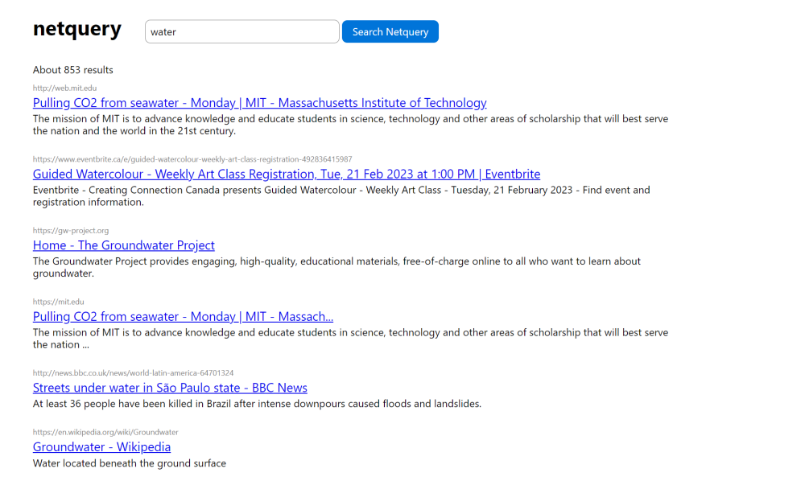

# Netquery
A search engine and web crawler written in Python.

## Features
- [x] Automatic web crawler
- [x] SQLite index
- [x] Automatic keyword extraction
- [x] Automatic description snippet generation
- [x] Keyword lemmatisation
- [x] Frontend search engine
- [x] PageRank algorithm
- [x] robots.txt caching and compliance
- [x] Robots meta tag compliance

## Running
Install the requirements:
`$ pip install -r requirements.txt`

Netquery consists of two components - the crawler and the search engine. For the search engine to work properly, you must run the crawler first for a few hours to generate the index. This may require some manual fine-tuning of the constants encoded in `crawler/crawler.py`. 

Additionally, ensure that you have authorisation from your network administrator, and you have enough free space on your disk - the pagerank index can take up a few gigabytes.

The crawler can run at the same time as the search engine.

_To run the search engine:_ `flask run`

_To run the crawler:_ `python crawler/crawler.py`

### Screenshot

### Licence
This project is licensed under the GNU Affero General Public License.
